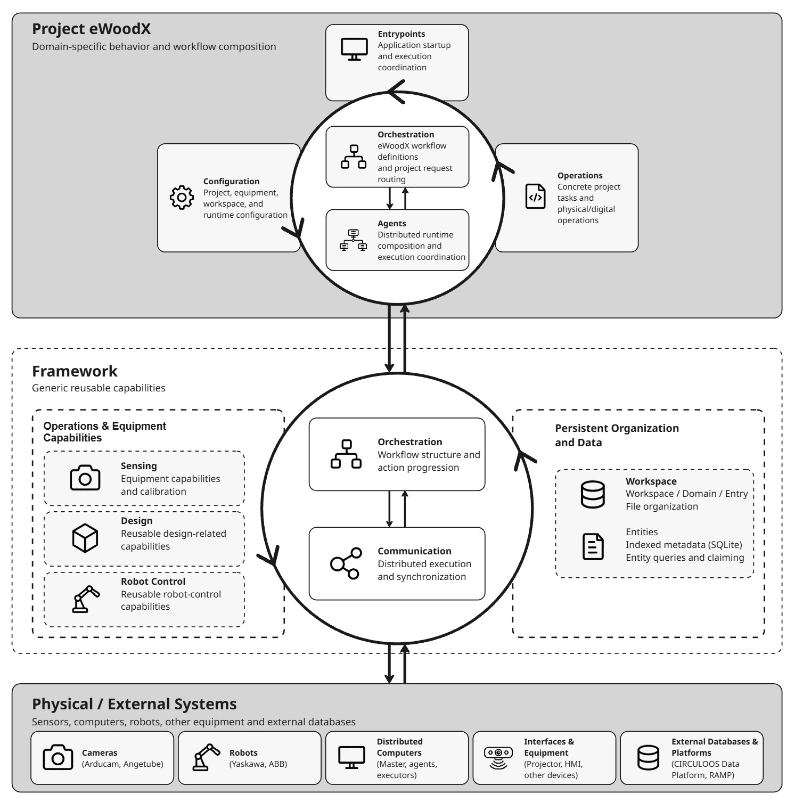

# eWoodX

`projects.ewoodx` contains the project-specific application layer for eWoodX.

eWoodX is being developed as a digital framework and distributed workflow for working with reclaimed timber, connecting physical material sensing, persistent digital information, computational processes, distributed agents, and physical/digital operations.

The project uses the reusable capabilities provided by the repository-level `framework` package while keeping eWoodX-specific configuration, operational logic, workflow definitions, runtime composition, and application entrypoints within the project layer.

The current implementation establishes the foundations for:

- sensing and measuring reclaimed Timber;
- persistent Timber entity creation and indexing;
- structured workspace organization;
- distributed Master/Agent communication;
- project-level orchestration;
- semantic entity queries and file access;
- camera calibration;
- projector calibration and projection;
- direct and distributed execution of sensing workflows.

The project is under **continuous development**. The current architecture should therefore be understood as the implemented and tested foundation of a broader workflow rather than as a completed final system.

---

# Project Structure

The current project is organized as:

```text
projects/ewoodx/
├── __init__.py
├── README.md
├── setup.py
│
├── config/
│   └── README.md
│
├── operations/
│   └── README.md
│
├── orchestration/
│   └── README.md
│
├── agents/
│   └── README.md
│
├── entrypoints/
│   └── README.md
│
└── calibration_data/
```

The main responsibilities are:

| Package / Module | Responsibility |
|---|---|
| [`config/`](config/README.md) | Project-specific configuration for workspace organization, sensing, entities, communication, and projection. |
| [`operations/`](operations/README.md) | Concrete eWoodX operations including calibration, Timber sensing, entity identity/allocation, and projection. |
| [`orchestration/`](orchestration/README.md) | eWoodX workflow definitions, project request routing, entity queries, and semantic file resolution. |
| [`agents/`](agents/README.md) | Long-running Master and Sensing Agent runtime composition. |
| [`entrypoints/`](entrypoints/README.md) | Application-level execution paths, including direct and distributed sensing. |
| `calibration_data/` | Persistent project-level camera and projector calibration data. |
| `setup.py` | Initializes persistent project calibration directories. |

Each major package contains its own README with detailed developer documentation.

---

# Architecture

The eWoodX application layer composes project-specific configuration, operations, orchestration, agents, and entrypoints around the reusable capabilities provided by the framework.

The overall relationship between the eWoodX project layer, the reusable framework, and the physical or external systems is illustrated below.



The architecture is organized into three principal layers:

```text
Project eWoodX
    │
    └── project-specific behavior and workflow composition
            │
            ▼
Framework
    │
    └── generic reusable capabilities
            │
            ▼
Physical / External Systems
    │
    └── sensors, computers, robots, interfaces,
        and external platforms
```


---

# Project and Framework Boundary

A central architectural principle is the separation between reusable mechanisms and project-specific behavior.

```text
framework
    │
    ├── communication protocol
    ├── action lifecycle
    ├── orchestration mechanism
    ├── workspace organization
    ├── entity persistence
    ├── file transport
    └── reusable sensing capabilities
```

while:

```text
projects.ewoodx
    │
    ├── project configuration
    ├── Timber semantics
    ├── sensing workflow
    ├── equipment configuration
    ├── project orchestration definitions
    ├── deployed agent composition
    ├── project request routing
    ├── project file resolution
    └── concrete operations
```

The framework should not need to understand what a Timber is, which camera eWoodX uses, or what an eWoodX sensing workflow means.

Similarly, project modules should reuse framework mechanisms rather than independently reimplement communication, persistence, or orchestration infrastructure.

---

# Current Application Areas

The project configuration establishes three principal workspace domains:

```text
sensing
design
robot_control
```

Conceptually:

```text
Workspace
    │
    ├── sensing
    │
    ├── design
    │
    └── robot_control
```

These domains provide an organizational foundation for the broader project workflow.

Their presence does **not** mean that all three currently have the same level of implementation.

The present implementation is most developed around:

```text
sensing
    +
persistent Timber data
    +
distributed workflow infrastructure
    +
projection
```

Design and robot-control workflows can be integrated progressively as their operational requirements become established.

---

# Configuration

Project-specific configuration is centralized under:

```text
projects/ewoodx/config/
```

It currently contains configuration for:

```text
workspace organization
sensing equipment
camera calibration
Timber entities
distributed communication
projection
```

Examples include:

```text
workspace layout
domain names
camera indices
camera resolutions
physical table dimensions
ArUco marker configuration
Timber index schema
Master ports
Sensing Agent identity
projector geometry
```

This keeps deployment and equipment values out of the generic framework.

For detailed documentation, see the [Configuration README](config/README.md).

---

# Workspace and Persistent Data

eWoodX uses the generic workspace model:

```text
Workspace
    │
    ▼
Domain
    │
    ▼
Entry
```

For indexed project entities, an Entry can additionally use:

```text
EntityManager
```

to provide persistent entity identity, metadata, indexing, discovery, and claiming.

For the current sensing workflow:

```text
Workspace
    │
    ▼
sensing Domain
    │
    ▼
Entry
    │
    ▼
EntityManager
    │
    ▼
Timber Entities
```

The workspace hierarchy and indexed entity layer have intentionally separate responsibilities.

A workspace does not inherently require indexed entities.

---

# Timber as a Persistent Entity

The current primary indexed project entity is:

```text
timber
```

Each sensed Timber receives a persistent project-specific identity.

The current indexed schema includes:

```text
color
length_mm
width_mm
thickness_mm
area_mm2
```

Conceptually:

```text
Physical Timber
      │
      ▼
Sensing Operation
      │
      ▼
Timber Entity
      │
      ├── persistent ID
      ├── canonical metadata
      ├── indexed properties
      └── associated artifacts
```

The entity manifest provides the canonical entity metadata/state, while the workspace-level entity database provides indexed discovery.

---

# Timber Entity Artifacts

A normally persisted sensed Timber currently contains artifacts such as:

```text
<timber_entity>/
├── entity.json
├── image.jpg
├── mask.png
├── overlay.jpg
└── measurements.json
```

`mask.png` may be absent when a mask is not available.

Conceptually:

```text
Timber Entity
     │
     ├── canonical metadata
     ├── source image
     ├── segmentation mask
     ├── visual overlay
     └── measurement data
```

The entity directory is the authoritative persistent location for these artifacts.

---

# Operations

Concrete project behavior is implemented under:

```text
projects/ewoodx/operations/
```

The current operations include:

```text
entity and entry allocation
camera calibration
camera tuning
Timber sensing and segmentation
Timber measurement
projector calibration
live projection
external geometry streaming
```

Operations are where project configuration and reusable framework capabilities are combined into executable eWoodX tasks.

Conceptually:

```text
Configuration
      +
Framework Capability
      +
Project Semantics
      │
      ▼
eWoodX Operation
      │
      ▼
Physical / Digital Result
```

For detailed operational documentation, see the [Operations README](operations/README.md).

---

# Current Sensing Equipment

The current sensing workflow supports two configured camera paths:

```text
Arducam
Angetube Webcam
```

Both ultimately support the current Timber sensing workflow, but their acquisition and calibration implementations differ according to their respective hardware and camera models.

Conceptually:

```text
                  Timber Sensing
                        │
              ┌─────────┴─────────┐
              │                   │
              ▼                   ▼
           Arducam             Angetube
              │                   │
              └─────────┬─────────┘
                        ▼
                Timber Measurement
                        │
                        ▼
                  Timber Entity
```

Camera-specific details are documented in the [Configuration README](config/README.md) and [Operations README](operations/README.md).

---

# Sensing Persistence Flow

The current sensing path can be summarized as:

```text
Camera
  │
  ▼
Image Acquisition
  │
  ▼
Calibration / World Mapping
  │
  ▼
Timber Segmentation
  │
  ▼
Measurement
  │
  ▼
Entity ID Allocation
  │
  ▼
EntityManager
  │
  ▼
Persistent Timber Entity
```

This connects physical material observation to persistent digital project information.

---

# Orchestration

Project-specific workflow definitions and request routing are located under:

```text
projects/ewoodx/orchestration/
```

The current distributed orchestration definition is:

```text
sensing
```

with the current step:

```text
sense_timber
```

targeted at:

```text
sensing
```

Conceptually:

```text
SENSING_ORCHESTRATION
        │
        ▼
sense_timber
        │
        ▼
target role: sensing
```

The project defines what work should exist.

The generic framework manages how that work progresses through the distributed action lifecycle.

For detailed documentation, see the [Orchestration README](orchestration/README.md).

---

# Distributed Runtime

The current distributed deployment contains two long-running agent processes:

```text
Master Agent
     │
     ▼
Sensing Agent
```

The Master is the authoritative side of the distributed workflow.

The Sensing Agent is the currently deployed execution agent for the:

```text
sensing
```

role.

Conceptually:

```text
                         MASTER
                           │
              authoritative action state
                           │
                           │ TCP
                           ▼
                    SENSING AGENT
                           │
                  local execution state
                           │
                           │ local TCP
                           ▼
                       EXECUTOR
                           │
                           ▼
                   sensing operation
```

For detailed runtime documentation, see the [Agents README](agents/README.md).

---

# Action Lifecycle

Distributed operations use the generic action lifecycle.

The current principal states are:

```text
PENDING
   │
   ▼
CLAIMED
   │
   ▼
RUNNING
   │
   ▼
COMPLETED
FAILED
or
CANCELLED
```

The Sensing Agent additionally maintains local execution state such as whether a claimed action has been consumed.

A central principle is:

> **Status ownership follows execution ownership.**

The Master owns authoritative distributed action state.

The agent owns durable local execution state.

The executor determines the actual outcome of the operation and reports it through the distributed workflow.

---

# Entrypoints

Application execution paths are defined under:

```text
projects/ewoodx/entrypoints/
```

The current sensing capability deliberately supports **two execution paths**:

```text
Direct Sensing
        │
        └── sensing_entrypoint.py

Distributed Sensing
        │
        └── sensing_agent_entrypoint.py
```

Both ultimately use:

```text
EWoodXSensingEntrypoint
```

and therefore converge on the same underlying sensing operations.

For detailed documentation, see the [Entrypoints README](entrypoints/README.md).

---

# Direct Sensing

The direct path runs the sensing process without requiring the distributed Master/Agent runtime.

```text
User
 │
 ▼
sensing_entrypoint.py
 │
 ▼
EWoodXSensingEntrypoint
 │
 ├── workspace
 ├── sensing entry
 ├── equipment
 └── EntityManager
 │
 ▼
Timber Sensing Operation
```

This path is useful for:

```text
local execution
manual sensing
development
testing
```

while retaining the same workspace and persistent entity model.

---

# Distributed Sensing

The distributed path wraps the same sensing capability in the Master/Agent action lifecycle.

```text
User
 │
 ▼
sensing_agent_entrypoint.py
 │
 ▼
Sensing Agent
 │
 ▼
Master
 │
 ▼
Sensing Orchestration
 │
 ▼
sense_timber Action
 │
 ▼
Sensing Agent claims Action
 │
 ▼
Executor consumes Action
 │
 ▼
EWoodXSensingEntrypoint
 │
 ▼
Timber Sensing Operation
 │
 ▼
COMPLETED / FAILED / CANCELLED
```

The distributed wrapper does not duplicate the Timber sensing implementation.

It changes the coordination and lifecycle around that implementation.

---

# Direct and Distributed Execution

The relationship between the two paths is:

```text
                    SENSING CAPABILITY
                           │
                           ▼
                EWoodXSensingEntrypoint
                           ▲
                           │
              ┌────────────┴────────────┐
              │                         │
              ▼                         ▼
          DIRECT MODE             DISTRIBUTED MODE
              │                         │
       local execution             Master + Agent
```

This separation allows sensing to remain usable independently while also participating in distributed workflows.

---

# Master-Side Data Access

The Master currently provides project-specific data discovery commands including:

```text
list_workspaces
list_indexed_entries
query_entities
```

These requests allow remote applications to discover project data through the Master rather than directly accessing the Master's SQLite database.

Conceptually:

```text
Remote Application
        │
        ▼
Master API
        │
        ▼
eWoodX Query Handler
        │
        ▼
EntityManager
        │
        ▼
Workspace Entity Index
```

The database remains an implementation detail behind the authoritative project interface.

---

# Entity Queries

The current query path supports application-driven entity selection.

Conceptually:

```text
query
 │
 ├── workspace
 ├── optional entry scope
 ├── entity type
 ├── indexed property filters
 └── availability
 │
 ▼
Master
 │
 ▼
EntityManager
 │
 ▼
matching entities
```

The indexed database determines which entities match the query.

The canonical entity manifest provides the complete entity information returned by the project layer.

This allows applications such as future design tools to query material information without directly accessing Master-local persistence.

---

# Entity File Transfer

The Master also provides a separate entity-file download service.

The request is semantic:

```text
workspace
entity ID
file
```

rather than exposing an arbitrary server-side filesystem path.

Conceptually:

```text
Client
  │
  ▼
semantic file request
  │
  ▼
Master File API
  │
  ▼
EWoodXEntityFileResolver
  │
  ▼
authoritative entity directory
  │
  ▼
generic TCP file transfer
  │
  ▼
Client destination
```

This keeps project path semantics separate from the generic file-transfer mechanism.

---

# Command and File Services

The current Master exposes two separate communication services:

```text
Command API
    │
    └── workflow / orchestration / queries

File API
    │
    └── entity-file transfer
```

The current configured ports are:

```text
5105  command API
5106  file API
```

The Sensing Agent currently exposes its local application API on:

```text
6105
```

These values are project configuration and may change with deployment requirements.

---

# Projection

The project currently contains operational support for:

```text
projector calibration
manual corner calibration
automatic calibration
live projection
external geometry streaming
```

Projection is currently part of the operational project layer rather than a distributed agent workflow.

Conceptually:

```text
Digital Geometry / Data
          │
          ▼
Projector Live Viewer
          │
          ▼
Projection Calibration
          │
          ▼
Physical Workspace
```

The projection implementation is documented in the [Operations README](operations/README.md) and its configuration in the [Configuration README](config/README.md).

---

# Temporary Projector Runtime Compatibility

The current project contains a temporary compatibility path:

```text
projector_runtime/
```

used to make Timber measurement information available to the current projection workflow.

This is explicitly a **development compatibility mechanism**.

The persistent Timber entity remains the authoritative source of Timber data.

Conceptually:

```text
Sensing
   │
   ├── authoritative
   │       │
   │       ▼
   │   Timber Entity
   │
   └── temporary compatibility
           │
           ▼
    projector_runtime/
```

As the design/data communication workflow develops, this compatibility path is intended to be removed or replaced by the authoritative entity/query/file-transfer workflow.

---

# Project Setup

Persistent project-level directories can be initialized through:

```text
projects/ewoodx/setup.py
```

The setup function is:

```python
setup_ewoodx_project() -> None
```

It prepares calibration directory structures for:

```text
Arducam
Angetube
Projector
```

using the generic:

```python
DirectoryManager
```

with project-defined calibration layouts.

---

# Running Project Setup

From the repository root:

```bash
python projects/ewoodx/setup.py
```

The setup process creates the required persistent calibration directories if they do not already exist.

Conceptually:

```text
projects/ewoodx/
└── calibration_data/
    ├── arducam/
    ├── webcam_angetube/
    └── projector/
```

The exact subdirectory layouts are defined in:

```text
projects.ewoodx.config
```

---

# Setup Does Not Create Workspaces

Runtime workspaces are intentionally **not** created by:

```text
setup.py
```

The distinction is:

```text
PROJECT SETUP
     │
     └── persistent project infrastructure
         such as calibration directories

WORKSPACE CREATION
     │
     └── runtime/project data context
```

Workspaces are created separately when a new project workspace is required.

This keeps persistent project calibration infrastructure separate from workspace data.

---

# Calibration Data

The project-level:

```text
calibration_data/
```

directory contains persistent calibration artifacts used by current equipment.

Its organization is controlled through the calibration layouts defined in:

```text
projects/ewoodx/config/
```

Conceptually:

```text
calibration_data/
│
├── arducam/
│   ├── intrinsic/
│   └── extrinsic/
│
├── webcam_angetube/
│   ├── intrinsic/
│   └── extrinsic/
│
└── projector/
    ├── manual/
    └── automatic/
```

These files belong to the project/equipment configuration context rather than to an individual runtime workspace.

---

# Runtime Data Locations

The current architecture distinguishes several types of persistent or runtime data.

```text
calibration_data/
      │
      └── project/equipment calibration

workspaces/
      │
      └── persistent project data and entities

agents_runtime/
      │
      └── distributed execution state

projector_runtime/
      │
      └── temporary projection compatibility data
```

These locations should not be treated as interchangeable.

---

# Data Authority

The current data model distinguishes authoritative data from runtime or compatibility state.

```text
AUTHORITATIVE PROJECT DATA
          │
          ▼
      Workspace
          │
          ▼
     Timber Entity
```

Distributed execution state is stored separately:

```text
agents_runtime/
```

and temporary projection compatibility state is stored separately:

```text
projector_runtime/
```

The persistent entity representation should remain the source of truth for sensed Timber information.

---

# Current End-to-End Sensing Architecture

The implemented sensing system can be summarized as:

```text
                           USER
                            │
              ┌─────────────┴─────────────┐
              │                           │
              ▼                           ▼
        DIRECT MODE                DISTRIBUTED MODE
              │                           │
              │                    Sensing Agent
              │                           │
              │                       Master
              │                           │
              └─────────────┬─────────────┘
                            ▼
                 EWoodXSensingEntrypoint
                            │
                  ┌─────────┴─────────┐
                  │                   │
                  ▼                   ▼
               Arducam             Angetube
                  │                   │
                  └─────────┬─────────┘
                            ▼
                    Timber Sensing
                            │
                            ▼
                     EntityManager
                            │
                            ▼
                    Timber Entity
                            │
                 ┌──────────┴──────────┐
                 │                     │
                 ▼                     ▼
             Metadata              Artifacts
                 │                     │
                 └──────────┬──────────┘
                            ▼
                       Workspace
```

This is currently the most complete end-to-end application path in the project.

---

# Current Distributed Architecture

The current distributed architecture can be summarized as:

```text
                     MASTER PROCESS
                           │
            ┌──────────────┴──────────────┐
            │                             │
            ▼                             ▼
       Command API                    File API
            │                             │
            ▼                             ▼
   Project + Workflow              Entity File
        Handlers                    Resolver
            │
            ▼
       ActionStore
            │
            ▼
       Orchestrator
            │
            │ TCP
            ▼
      SENSING AGENT
            │
      AgentActionStore
            │
      ┌─────┴─────┐
      │           │
      ▼           ▼
 AgentPoller   Local API
                  │
                  ▼
               Executor
                  │
                  ▼
          Sensing Entrypoint
                  │
                  ▼
              Operation
```

This architecture keeps distributed coordination separate from the actual sensing implementation.

---

# Current Development Boundary

The current implementation establishes a working foundation for:

```text
physical sensing
        │
        ▼
persistent digital Timber
        │
        ▼
indexed discovery
        │
        ▼
distributed access
```

The broader project can build on this foundation toward:

```text
design processes
        │
        ▼
material selection
        │
        ▼
fabrication planning
        │
        ▼
robot control
```

These later stages should be integrated incrementally rather than being assumed as already implemented.

---

# Package Documentation

Detailed developer documentation is available for each major project package:

### [Configuration](config/README.md)

Project-specific configuration for:

```text
workspace configuration
camera configuration
entity configuration
communication configuration
projection configuration
```

### [Operations](operations/README.md)

Concrete project operations for:

```text
entity and entry allocation
camera calibration
camera tuning
Timber sensing
measurement and persistence
projector calibration
live projection
```

### [Orchestration](orchestration/README.md)

Project workflow and request handling for:

```text
workflow definitions
Master request routing
Agent request routing
entity queries
entity-file resolution
```

### [Agents](agents/README.md)

Distributed runtime composition for:

```text
Master Agent
Sensing Agent
runtime composition
distributed persistence
network services
```

### [Entrypoints](entrypoints/README.md)

Application execution paths for:

```text
direct sensing
distributed sensing
workspace resolution
entry resolution
equipment selection
distributed execution
terminal reporting
```

---

# Responsibility Map

The current project responsibilities can be summarized as:

| Layer | Responsibility |
|---|---|
| [`config`](config/README.md) | What project-specific values should be used? |
| [`operations`](operations/README.md) | How is a concrete project task performed? |
| [`orchestration`](orchestration/README.md) | What project work should exist and how are project requests routed? |
| [`agents`](agents/README.md) | Which long-running distributed services are deployed and how are they composed? |
| [`entrypoints`](entrypoints/README.md) | How does a user/application start a concrete process? |
| `framework` | Which reusable mechanisms make these layers possible? |

A useful shorthand is:

```text
CONFIG
    │
    └── defines values

OPERATIONS
    │
    └── perform work

ORCHESTRATION
    │
    └── defines/releases work

AGENTS
    │
    └── distribute work

ENTRYPOINTS
    │
    └── start work

FRAMEWORK
    │
    └── provides reusable mechanisms
```

---

# Development Principles

When extending the project:

1. Keep reusable mechanisms in the repository-level `framework`.
2. Keep eWoodX-specific semantics in `projects.ewoodx`.
3. Keep deployment and equipment values centralized in `config`.
4. Keep concrete physical/digital task logic in `operations`.
5. Keep project workflow definitions and request routing in `orchestration`.
6. Keep long-running distributed runtime composition in `agents`.
7. Keep application startup and execution coordination in `entrypoints`.
8. Preserve the separation between authoritative project data and runtime execution state.
9. Keep the Master authoritative for distributed workflow state.
10. Keep agent-local execution state durable and separate from Master persistence.
11. Prefer semantic project requests over exposing raw server-side paths.
12. Reuse the same operation path across direct and distributed execution where practical.
13. Introduce new abstractions only when established operational requirements justify them.
14. Extend the architecture incrementally as design, fabrication, and robot-control workflows become concrete.

---

# Ongoing Development

The current architecture should be treated as a working and evolving foundation.

The strongest implemented path is currently:

```text
Sensing
   │
   ▼
Timber Entity
   │
   ▼
Persistent Workspace
   │
   ▼
Indexed Discovery
   │
   ▼
Distributed Query / File Access
```

The framework and project structure are designed so that additional capabilities can be connected to this persistent material representation without coupling them directly to the sensing implementation.

As development continues, likely areas of expansion include:

```text
design-side material querying
design data generation
additional distributed agents
robot-control workflows
fabrication workflows
external data-platform integration
```

These should be documented as implemented rather than treated as existing capabilities before their operational behavior is established.

---

# Summary

eWoodX currently connects:

```text
PHYSICAL TIMBER
      │
      ▼
SENSING
      │
      ▼
MEASUREMENT
      │
      ▼
PERSISTENT TIMBER ENTITY
      │
      ▼
WORKSPACE / INDEX
      │
      ▼
DISTRIBUTED ACCESS
```

around a reusable framework for:

```text
workspace organization
entity persistence
communication
file transfer
distributed action lifecycle
orchestration
sensing capabilities
```

The project layer gives those generic mechanisms their application-specific meaning.

The current architectural relationship is:

```text
                         eWoodX
                           │
          ┌────────────────┼────────────────┐
          │                │                │
          ▼                ▼                ▼
       Sensing          Project Data    Distributed
       Operations       + Entities      Runtime
          │                │                │
          └────────────────┼────────────────┘
                           ▼
                    Project Workflows
                           │
                           ▼
                       Framework
                           │
                           ▼
              Reusable Digital Infrastructure
```

The architecture intentionally keeps project operations, persistent data, distributed coordination, and reusable framework mechanisms separated so that the workflow can expand incrementally as additional eWoodX capabilities are developed.